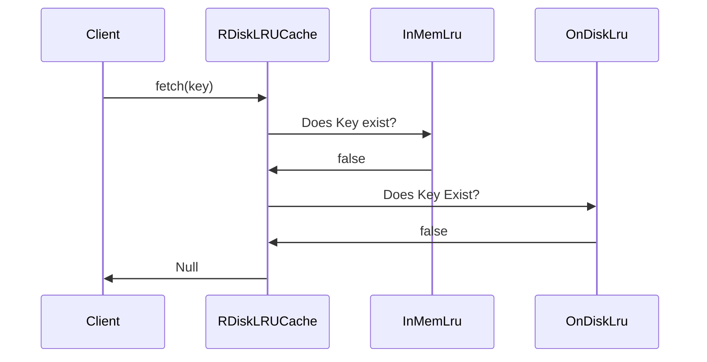
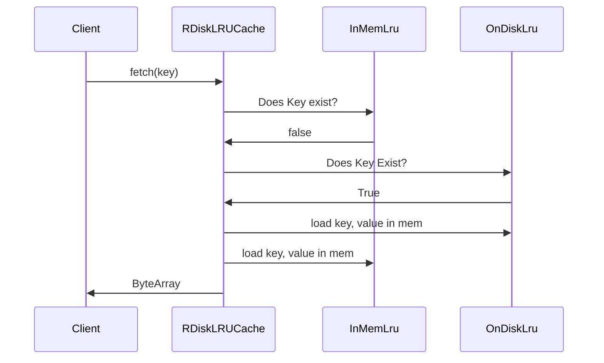
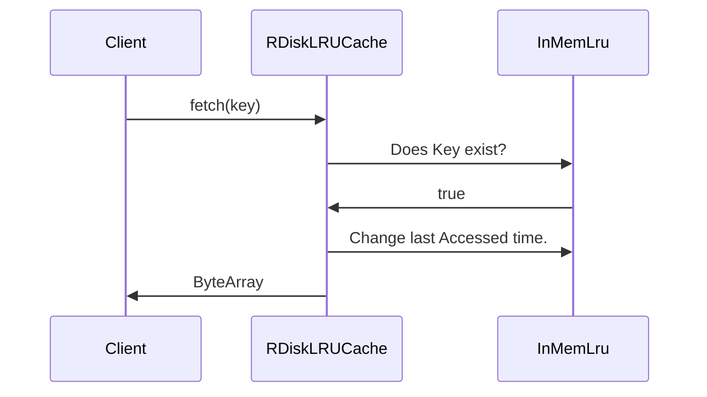
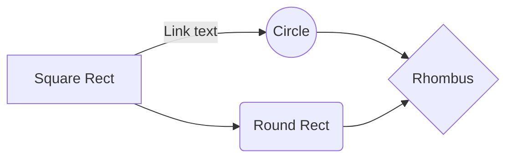

# README: RDiskLRUCache

`RDiskLRUCache` is a disk-based LRU cache implementation for Android. It efficiently stores and retrieves data on a local disk, using a Least Recently Used (LRU) eviction policy to manage cache size.


# Key Features:

-   **Persistence:** Data is persisted to disk, ensuring it's retained even after the application restarts.
-   **Thread Safety:** Uses a `ReentrantReadWriteLock` for thread-safe access to the cache.
-   **Journaling:** Employs journaling to maintain data consistency and recover from failures.
-   **Asynchronous Operations:** Many operations are performed asynchronously using coroutines for improved performance.
-   **Customizable:** Can be configured with various options, including cache size, location, and eviction policies.

## Sequence

Cache Miss 


Cache Hit First fetch call

Cache Hit Subsequent fetch call

Cache  Store call
 ```mermaid
sequenceDiagram
Client ->> RDiskLRUCache : store(key, byteArray)
RDiskLRUCache ->> InMemLru: Does Key exist?
InMemLru ->> RDiskLRUCache: store(key, byteArray)
RDiskLRUCache ->> Client
```
Cache  Flush call
 ```mermaid
sequenceDiagram
Client ->> RDiskLRUCache : store(key, byteArray)
RDiskLRUCache ->> InMemLru: Does Key exist?
InMemLru ->> RDiskLRUCache: store(key, byteArray)
RDiskLRUCache ->> Client
```



## Usage

**Gradle Dependency (replace `<version>` with the latest version):**

```
dependencies {
  implementation "com.github.your-username:r-disk-lru-cache:<version>"
}

```

**Import the library:**

Kotlin

```
import diy.rcache.lru.RDiskLRUCache

```

Use code [with caution.](/faq#coding)

**1. Create a `RDiskLRUCache` instance:**
```
val cacheConfig = RDiskLRUCache.Builder()
  .maxSizeOnDisk(1024L * 1024L * 10)
  .maxSizeInMem(1024L * 1024L)
  .cacheLocation(File("/path/to/cache/directory")) 
  .build()
```

**2. Store data in cache **

***Using a ByteArray:***
 This code first creates an `RDiskLRUCache` instance with a maximum size of 2GB and a cache location of `/data/cache`. Then, it stores a cache entry with the key "my_key" and the value "some data". Finally, it calls the `flush()` method to persist all cached data to disk.


```
val key = "my_data_key"
val value = "This is some data to be cached".toByteArray()
cache.store(key, value)
```

**3 . Fetch data from cache **

```
val fetchedData = cache.fetch(key)

if (fetchedData != null) {
  val dataString = String(fetchedData)
  // Use the retrieved data
} else {
  // Data not found in cache
}
```

**3. Flush Cache (write updated entries to disk and remove old entries):**

```
val flushDeferred = cache.flush()

// Wait for the operation to complete
val flushed = flushDeferred.await()

if (flushed) {
  Log.d("RDiskLRUCache", "Cache flushed successfully")
} else {
  Log.w("RDiskLRUCache", "Failed to flush cache")
}
```
*** Best Practices for invoking flush ***

To ensure optimal efficiency, consistency, and persistence in your `RDiskLRUCache` implementation, consider the following best practices when calling the `flush()` method:

-   **Periodic Flushing:** Regularly flush the cache to disk to prevent data loss in case of unexpected application termination or system crashes. A good approach is to schedule periodic flushes using a timer or background task.
-   **Batch Flushing:** If your application performs frequent updates to the cache, consider batching multiple updates together and flushing them in a single operation to reduce I/O overhead. This can improve performance, especially for large caches or slow storage devices.
-   **Manual Flushing:** For critical operations where data consistency is paramount, you can manually flush the cache immediately after making changes. This ensures that the latest data is persisted to disk.
-   **Avoid Excessive Flushing:** While frequent flushing is important for data integrity, excessive flushing can degrade performance. Strike a balance between consistency and efficiency based on your application's specific requirements.
-   **Consider Asynchronous Flushing:** If your application can tolerate some delay in data persistence, you can use asynchronous flushing to avoid blocking the main thread. This can improve responsiveness and user experience.

By following these best practices, you can optimize the performance and reliability of your `RDiskLRUCache` implementation.

**Memory management - additional strategies:**

For uses on Android if you would like to manage the size of the memory you could register a receiver for ACTION_DEVICE_STORAGE_LOW and invoke the cache management functions

```
val lowMemoryReceiver = object : BroadcastReceiver() {
    override fun onReceive(context: Context?, intent: Intent?) {
        if (intent?.action == Intent.ACTION_DEVICE_STORAGE_LOW) {
            // Low memory condition detected
            cache.clearMemoryCache() // Clear in-memory cache
        }
    }
}

registerReceiver(lowMemoryReceiver, IntentFilter(Intent.ACTION_DEVICE_STORAGE_LOW))
```
**Memory management - additional strategies:**

```
// In your logout function
cache.clearAll().await() // Clear all cache data on logout

```
This will clear all data from both the in-memory cache and the disk cache, ensuring that the user's data is completely removed from the application.

Here's a complete example with a logout button:

Kotlin

```
class MyActivity : AppCompatActivity() {

    private lateinit var cache: RDiskLRUCache

    override fun onCreate(savedInstanceState: Bundle?) {
        super.onCreate(savedInstanceState)
        setContentView(R.layout.activity_main)

        // Initialize the    cache
        cache = RDiskLRUCache.Builder()
            .maxSizeOnDisk(1024L * 1024L * 10) // Set max cache size on disk (10 MB)
            .maxSizeInMem(1024L * 1024L) // Set max cache size in memory (1 MB)
            .build()

        // Find the logout button
        val logoutButton = findViewById<Button>(R.id.logout_button)

        // Set a click listener for the logout button
        logoutButton.setOnClickListener {
            // Clear the cache on logout
            cache.clearAll().await()

            // Perform other logout actions (e.g., navigate to login screen)
            finish()
        }
    }
}

```


In this example, the `clearAll` method is called when the user clicks the logout button. You can customize the logout logic to suit your specific application needs.

**Additional notes:**

-   The `clearAll` method is an asynchronous operation, so you need to use `await()` to wait for it to complete before proceeding with other actions.
-   Consider using a progress indicator or loading screen while the cache is being cleared to provide a better user experience.
-   If you have sensitive user data stored in the cache, ensure that it is securely deleted to protect user privacy.

-   **Adjust cache size:** If you frequently encounter low memory situations, you can reduce the in-memory cache size and rely more on disk storage.
-   **Evict less frequently used data:** Implement a more granular eviction policy based on usage frequency or other criteria.
-   **Optimize data size:** If possible, reduce the size of cached data to minimize memory usage

